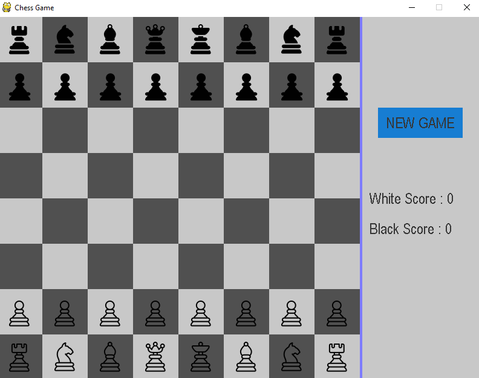

# Py-Chess

### Python implementation of a Chess Game :
An AI has been built to play the opponent 

Strategy : decision tree with alpha beta pruning and a score function evaluated on many paramters : material, position, central control, mobility and king safety. 

